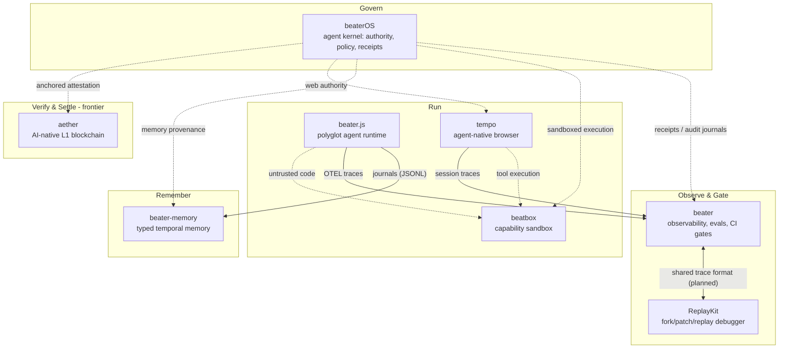

# ecosystem

**A family of Rust-first, local-first infrastructure projects for the agent era — each one standalone, all of them composable.**

Every project here earns its existence on its own: it solves one problem completely, runs locally from a single binary or workspace, and integrates with its siblings **only over protocol boundaries** (OpenTelemetry, MCP, REST, JSONL journals) — never through code coupling. You can adopt any one of them without the others. Together they form a full stack for building, running, observing, and governing AI agents.

## The map

Solid arrows are integrations that exist today; dotted arrows are designed-for connections that land only when a real consumer needs them.

## The projects

| Project | One-liner | Standalone value | Connects to the family via |
| --- | --- | --- | --- |
| [beater](https://github.com/jadenfix/beater) | Agent observability, replay, eval, and CI-gate platform | Plain OTEL ingest — works with any agent, no Beater-specific code | Consumes traces from any sibling; its evals gate changes across the family |
| [ReplayKit](https://github.com/jadenfix/ReplayKit) | Local-first replay debugger: record, fork, patch one step, replay affected work, diff | Full record→fork→diff loop with its own collector, API, and web UI | Deep-replay lane for beater traces and tempo session forks |
| [beater-memory](https://github.com/jadenfix/beater-memory) | Typed temporal memory projected from append-only agent traces | Local Rust app/library with provenance, contradiction warnings, token budgets | Imports beater.js journals and canonical span JSONL; serves memory to any runtime |
| [beater.js](https://github.com/jadenfix/beater.js) | One Rust binary that serves your web app and runs durable polyglot agents (V8 + CPython + Rust + Wasm) | Full-stack agent runtime with journaled, resumable runs; tools speak MCP natively | Journals feed beater-memory; traces feed beater; beatbox is the planned Wasm sandbox tier |
| [beatbox](https://github.com/jadenfix/beatbox) | Standalone sandbox service for untrusted, agent-generated code behind explicit capabilities | CLI, daemon, REST API, and MCP endpoint over a hermetic Wasmtime lane | Sandbox lane for beater.js, tempo tool execution, and beaterOS sandboxed side effects |
| [tempo](https://github.com/jadenfix/tempo) | AI-agent-native browser: structured observation, batched semantic actions, state forking, API-first fast path | A browser agents can drive at ~2–5KB per observation instead of screenshot-and-click | Uses beatbox for sandboxing and the audited [servo fork](https://github.com/jadenfix/servo) as its Rust engine; sessions observable in beater |
| [beaterOS](https://github.com/jadenfix/beaterOS) | Agent-first OS layer: explicit authority, deterministic policy, receipts, eval gates, auditable side effects | A local agent kernel spec + Rust contract crate usable by any runtime | The governance spine: policy for beater.js/tempo, execution via beatbox, provenance via beater-memory, receipts into beater |
| [aether](https://github.com/jadenfix/aether) | Rust-first L1 blockchain with AI-native verification (TEE + VCR), parallel WASM execution, sub-2s finality | A complete L1: consensus, ledger, runtime, SDKs, explorer | Frontier project: potential verifiable-compute and settlement layer for agent economies; on-chain anchoring for beaterOS/beater attestations |

## Design principles

1. **Standalone before integrated.** Each project must be independently useful and independently adoptable. No project may require a sibling to deliver its core value.
2. **Protocol boundaries, not code coupling.** Siblings talk over OTEL, MCP, REST, and journal/span JSONL. No shared internal crates across repo boundaries.
3. **Local-first, Rust-first.** Everything runs on your machine from `cargo` or one binary. Hosted is an option, never a requirement.
4. **No speculative integration.** A connection ships only when a real consumer exists on both sides ("deferred-with-consumer"). Dead glue code is deleted.
5. **Evidence-gated change.** Changes land through non-author review and CI gates; the ecosystem dogfoods beater to hold itself to that bar.

## Roadmap

The sequencing principle: **win individually first, converge on contracts second, compose third.** Integration is never allowed to block a project's standalone success.

### Phase 1 — Standalone depth (now)
Each project sharpens its own wedge:
- **beater** — the one-binary observe→dataset→eval→gate loop, OTEL-native.
- **tempo** — structured observation + batched actions on the Servo lane; CDP fallback hardening.
- **beater.js** — the M8 build/deploy story; multi-isolate route concurrency.
- **beatbox** — native Python/JS lanes and stateful sessions beyond the Wasm wedge.
- **beater-memory** — provider distillation and bitemporal query hardening.
- **ReplayKit** — fork/patch/replay ergonomics and diff quality.
- **beaterOS** — contract crate + conformance suite toward the minimum viable kernel.
- **aether** — testnet hardening: consensus, parallel runtime, DA under adversarial load.

### Phase 2 — Contract convergence
- One **canonical span/journal schema** shared by beater, ReplayKit, beater-memory, and beater.js (today there is more than one trace shape; converge before deep composition).
- **MCP everywhere**: every service that can act as a tool exposes an MCP endpoint (beatbox and beater.js already do; tempo and beater follow).
- Positioning clarity between **beater** (platform: observe, eval, gate) and **ReplayKit** (specialist: deep fork/patch/replay) — shared format, distinct jobs.

### Phase 3 — Pairwise integrations (each gated on a real consumer)
- beater.js → beatbox as the Wasmtime sandbox tier.
- tempo tool execution → beatbox.
- tempo sessions → beater traces and evals.
- beaterOS receipts/audit journals → beater ingest.
- beater-memory as the memory backend for beater.js agents (journal import already works).

### Phase 4 — The composed story
An agent runs durably in **beater.js**, under **beaterOS** authority and policy, browsing through **tempo**, executing untrusted code in **beatbox**, remembering through **beater-memory**, with every run observed, replayable, and CI-gated by **beater** + **ReplayKit** — and, at the frontier, with attestations verifiable and settleable on **aether**.

## What is deliberately *not* here

Private business planning, coursework, and one-off research repos are out of scope. This index tracks the active, public, composable infrastructure family only.

## Contributing

Each repo owns its own issues, CI, and review rules (non-author review; no self-merge). Cross-cutting proposals — shared schemas, protocol changes, roadmap sequencing — belong here in [ecosystem issues](https://github.com/jadenfix/ecosystem/issues).
